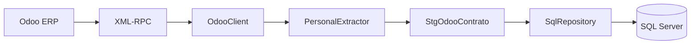
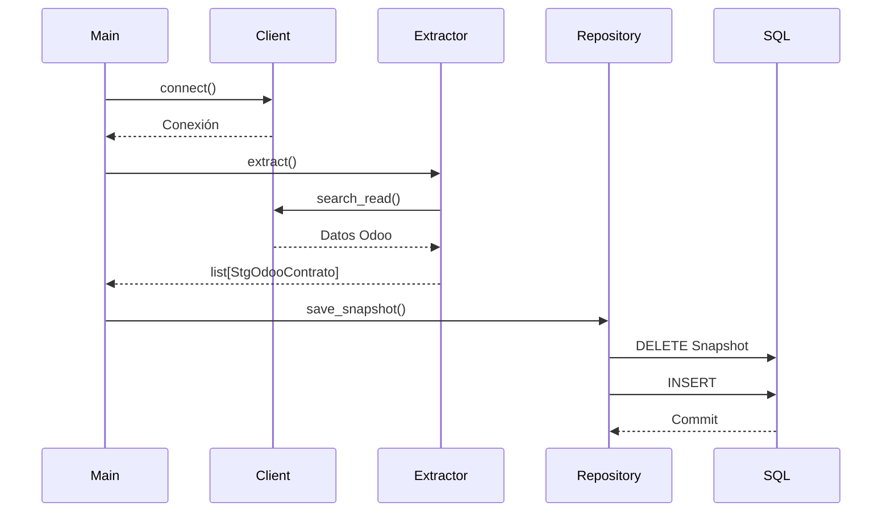
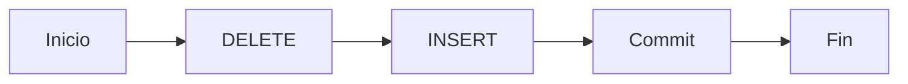

<div align="center">

# 📦 ETL Odoo → SQL Server

### Sincronización Snapshot de Contratos de Personal

Extracción de información contractual desde **Odoo ERP** mediante **XML-RPC**, enriquecimiento de datos organizacionales y carga Snapshot hacia **SQL Server** para procesos corporativos de integración.

---


</div>

---

# Descripción

Este proyecto implementa un proceso **ETL Snapshot** para sincronizar la información contractual del módulo de Recursos Humanos de **Odoo ERP** hacia una tabla de staging en **SQL Server**.

El proceso realiza la extracción mediante **XML-RPC**, consulta los catálogos relacionados para enriquecer la información y construye un modelo tipado (`StgOdooContrato`) listo para su persistencia.

La arquitectura fue diseñada priorizando:

- Separación de responsabilidades
- Código mantenible
- Bajo acoplamiento
- Alta cohesión
- Tipado fuerte mediante Dataclasses
- Logging completo por ejecución
- Facilidad para incorporar nuevos ETL

---

# Arquitectura General



---

# Flujo de Ejecución



---

# Arquitectura del Proyecto

```text
.
│
├── clients/
│   └── odoo_client.py
│
├── config/
│   ├── settings.py
│   └── settings.json
│
├── context/
│   └── execution_context.py
│
├── extractors/
│   └── personal_extractor.py
│
├── models/
│   └── stg_odoo_contrato.py
│
├── repositories/
│   └── sql_repository.py
│
├── tools/
│   ├── discover_model.py
│   └── discover_models.py
│
├── logs/
│
├── main.py
│
└── README.md
```

---

# Flujo Interno del Extractor

```mermaid
flowchart TD

A[extract()]

A --> B[_load_contracts]

B --> C[_collect_ids]

C --> D[_load_catalog]

D --> EMP[Employees]

D --> DEP[Departments]

D --> JOB[Jobs]

D --> COM[Companies]

D --> CAL[Calendars]

EMP --> ROW

DEP --> ROW

JOB --> ROW

COM --> ROW

CAL --> ROW

ROW[_build_row()]

ROW --> MODEL[StgOdooContrato]

MODEL --> END[List]
```

---

# Componentes

## OdooClient

Responsabilidades

- Conexión XML-RPC
- Autenticación
- Ejecución genérica de métodos Odoo
- Sin reglas de negocio

---

## PersonalExtractor

Responsabilidades

- Extraer contratos
- Obtener catálogos relacionados
- Resolver relaciones
- Construir modelos tipados

No realiza persistencia.

---

## SqlRepository

Responsabilidades

- Carga Snapshot
- Transacciones SQL Server
- Persistencia
- Manejo de errores

No contiene lógica de negocio.

---

## ExecutionContext

Centraliza la información de cada ejecución.

Incluye:

- ExecutionId
- Fecha de inicio
- Archivo de Log
- Información compartida durante la ejecución

---

## StgOdooContrato

Modelo tipado que representa un registro listo para persistir.

Contiene información como:

- Contrato
- Empleado
- Rut
- Nombres
- Apellidos
- Cargo
- Departamento
- Empresa
- Empresa Padre
- Rut Empresa
- Rut Empresa Padre
- Calendario
- Metadata ETL

---

# Snapshot

Cada ejecución realiza una sincronización completa.



La tabla staging siempre representa el estado actual existente en Odoo.

---

# Logging

Cada ejecución genera un archivo independiente.

Ejemplo

```
logs/

etl_20260713_145822.log
etl_20260713_154012.log
etl_20260714_080501.log
```

Cada log registra:

- Inicio
- ExecutionId
- Conexión
- Cantidad de registros
- Errores
- Tiempo de ejecución

---

# Herramientas de Desarrollo

El proyecto incorpora herramientas para inspeccionar modelos de Odoo.

Actualmente disponibles:

- DiscoverModel
- DiscoverModels

Permiten:

- Consultar modelos
- Descubrir campos
- Inspeccionar registros
- Detectar campos personalizados
- Explorar nuevos catálogos

---

# Características Técnicas

- Arquitectura ETL desacoplada
- Cliente XML-RPC reutilizable
- Dataclasses
- Logging por ejecución
- ExecutionContext
- Tipado fuerte
- Snapshot transaccional
- SQL Server
- XML-RPC
- Código preparado para nuevos ETL

---

# Principios de Diseño

- Single Responsibility Principle (SRP)
- Separation of Concerns
- Clean Architecture
- Alta Cohesión
- Bajo Acoplamiento
- Reutilización
- Tipado Explícito
- Código mantenible

---

# Extensibilidad

La arquitectura fue diseñada para reutilizar la infraestructura en nuevos procesos.

Ejemplo

```text
extractors/

personal_extractor.py
centro_costo_extractor.py
cargo_extractor.py
empleado_extractor.py
vacaciones_extractor.py
```

Todos reutilizan:

- OdooClient
- SqlRepository
- ExecutionContext
- Logging
- Configuración

---

# Tecnologías

| Tecnología | Uso |
|------------|-----|
| Python 3.13 | Desarrollo |
| XML-RPC | Comunicación con Odoo |
| Odoo ERP | Sistema origen |
| SQL Server | Base de datos destino |
| pyodbc | Acceso SQL Server |
| Dataclasses | Modelos |
| Logging | Trazabilidad |
| Mermaid | Diagramas |

---

# Estado del Proyecto

| Módulo | Estado |
|---------|--------|
| Configuración | ✅ |
| OdooClient | ✅ |
| PersonalExtractor | ✅ |
| Catálogos relacionados | ✅ |
| Dataclass | ✅ |
| Snapshot SQL | ✅ |
| Logging | ✅ |
| ExecutionContext | ✅ |
| Herramientas Odoo | ✅ |
| Nuevos ETL | 🚧 |

---

# Roadmap

- [x] Cliente XML-RPC genérico
- [x] Extractor de contratos
- [x] Arquitectura desacoplada
- [x] Snapshot SQL Server
- [x] Logging por ejecución
- [x] ExecutionContext
- [x] Herramientas de inspección Odoo
- [ ] ETL de Centros de Costo
- [ ] ETL de Empleados
- [ ] ETL de Cargos
- [ ] ETL de Calendarios
- [ ] Pruebas Unitarias
- [ ] Integración CI/CD

---

# Autor

**ETL Odoo → SQL Server**

Jefe Proyectos TI - RIOblanco SPA - Istok Carvallo

Arquitectura desarrollada para procesos corporativos de integración entre **Odoo ERP** y plataformas empresariales, priorizando mantenibilidad, trazabilidad, escalabilidad y reutilización.