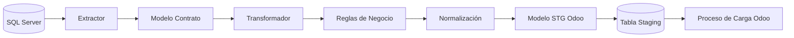
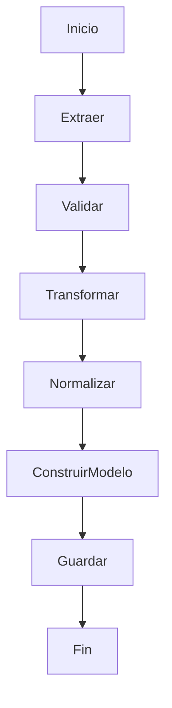
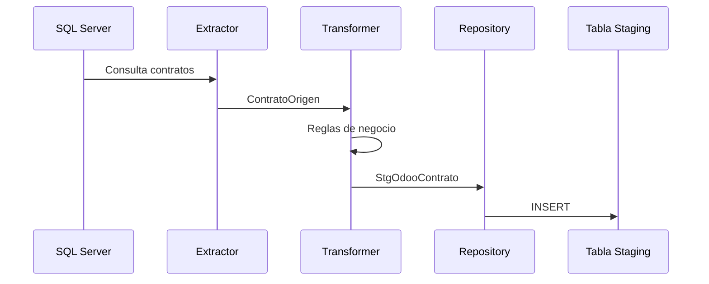
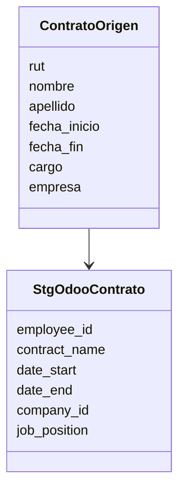
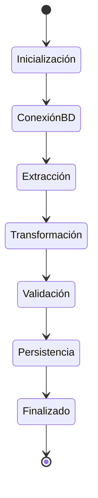
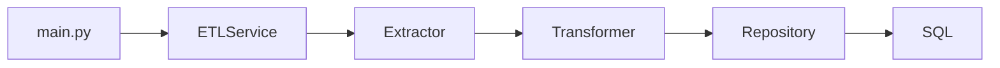

# ETL Contratos → Odoo

<div align="center">

# 📦 ETL de Integración de Contratos hacia Odoo

### Extracción • Transformación • Validación • Persistencia

ETL desarrollado en **Python** para extraer información contractual desde el sistema origen, normalizarla y generar una estructura de datos preparada para su carga en **Odoo ERP**.

---


</div>

---

# Descripción

Este proyecto implementa un proceso **ETL (Extract, Transform & Load)** cuyo objetivo es obtener la información contractual de colaboradores desde un sistema origen, transformarla según las reglas de negocio definidas y almacenarla en una estructura preparada para su posterior carga hacia **Odoo**.

El proyecto fue diseñado bajo los siguientes principios:

- Arquitectura por capas
- Separación de responsabilidades
- Código mantenible
- Modelos tipados
- Alta trazabilidad
- Fácil incorporación de nuevos procesos ETL

---

# Objetivos

- Extraer información desde SQL Server.
- Separar completamente extracción y transformación.
- Aplicar reglas de negocio centralizadas.
- Normalizar los datos.
- Validar consistencia.
- Persistir información preparada para Odoo.
- Facilitar futuras integraciones.

---

# Arquitectura General



---

# Arquitectura del Proyecto

```text
etl_odoo_contratos/

│
├── config/
│     Configuración
│
├── database/
│     Conexión SQL Server
│
├── extractors/
│     Extracción de datos
│
├── transformers/
│     Reglas de transformación
│
├── models/
│     Modelos de dominio
│
├── repositories/
│     Persistencia
│
├── services/
│     Orquestación ETL
│
├── utils/
│     Utilidades
│
├── logs/
│
├── main.py
│
└── README.md
```

---

# Flujo ETL



---

# Flujo de Datos



---

# Capas del Sistema

## Extractor

Responsabilidades:

- Ejecutar consultas SQL.
- Leer información origen.
- Mapear registros.
- No aplica reglas de negocio.

Salida:

```
ContratoOrigen
```

---

## Transformer

Responsabilidades:

- Normalización.
- Conversión de tipos.
- Reglas de negocio.
- Limpieza de datos.
- Construcción del modelo destino.

Salida:

```
StgOdooContrato
```

---

## Repository

Responsabilidades:

- Persistencia.
- Insert.
- Update.
- Delete.
- Transacciones.

No contiene reglas de negocio.

---

## Models

Contiene únicamente objetos de dominio.

Ejemplo:

```
ContratoOrigen

↓

StgOdooContrato
```

---

# Flujo de Objetos



---

# Principios de Diseño

El proyecto sigue principios de ingeniería de software:

- Single Responsibility Principle (SRP)
- Separation of Concerns
- Alta Cohesión
- Bajo Acoplamiento
- Código Tipado
- Arquitectura por capas
- Componentes reutilizables

---

# Ciclo de Ejecución



---

# Responsabilidad de cada componente

| Componente | Responsabilidad |
|------------|-----------------|
| Config | Parámetros del sistema |
| Database | Conexiones SQL |
| Extractors | Obtención de datos |
| Models | Objetos de dominio |
| Transformers | Reglas de negocio |
| Repositories | Persistencia |
| Services | Orquestación |
| Utils | Funciones auxiliares |
| Logs | Registro de ejecución |

---

# Modelo de Ejecución



---

# Características Técnicas

- Arquitectura ETL por capas
- Modelos tipados mediante clases
- Separación entre extracción y transformación
- Reglas de negocio desacopladas
- Persistencia independiente
- Fácil mantenimiento
- Escalable para nuevos procesos
- Logging centralizado
- Preparado para pruebas unitarias

---

# Escalabilidad

La arquitectura permite agregar nuevos procesos ETL sin modificar los existentes.

Ejemplo:

```text
extractors/
    contratos.py
    empleados.py
    cargos.py

transformers/
    contrato_transformer.py
    empleado_transformer.py
    cargo_transformer.py

repositories/
    contrato_repository.py
    empleado_repository.py
    cargo_repository.py
```

Cada proceso mantiene su propia lógica, reutilizando la infraestructura común.

---

# Tecnologías

| Tecnología | Uso |
|------------|-----|
| Python 3.11+ | Desarrollo |
| SQL Server | Base de datos origen |
| ODBC Driver | Conectividad |
| Dataclasses | Modelos |
| Logging | Trazabilidad |
| Mermaid | Diagramas |

---

# Convenciones

- Una clase por archivo.
- Nombres descriptivos.
- Sin lógica SQL en los transformadores.
- Sin reglas de negocio en los repositories.
- Tipado explícito.
- Logging en cada etapa crítica.
- Separación clara entre dominio y persistencia.

---

# Estado del Proyecto

| Módulo | Estado |
|---------|--------|
| Configuración | ✅ |
| Conexión BD | ✅ |
| Extractor | ✅ |
| Modelos | ✅ |
| Transformadores | 🚧 |
| Persistencia | 🚧 |
| Carga Odoo | ⏳ |

---

# Roadmap

- [x] Arquitectura base
- [x] Extractor de contratos
- [x] Modelos tipados
- [ ] Transformaciones
- [ ] Persistencia en Staging
- [ ] Validaciones de negocio
- [ ] Integración completa con Odoo
- [ ] Pruebas unitarias
- [ ] Pipeline CI/CD

---

# Autor

**Proyecto ETL Odoo**

Arquitectura orientada a procesos ETL empresariales con foco en mantenibilidad, trazabilidad y escalabilidad.